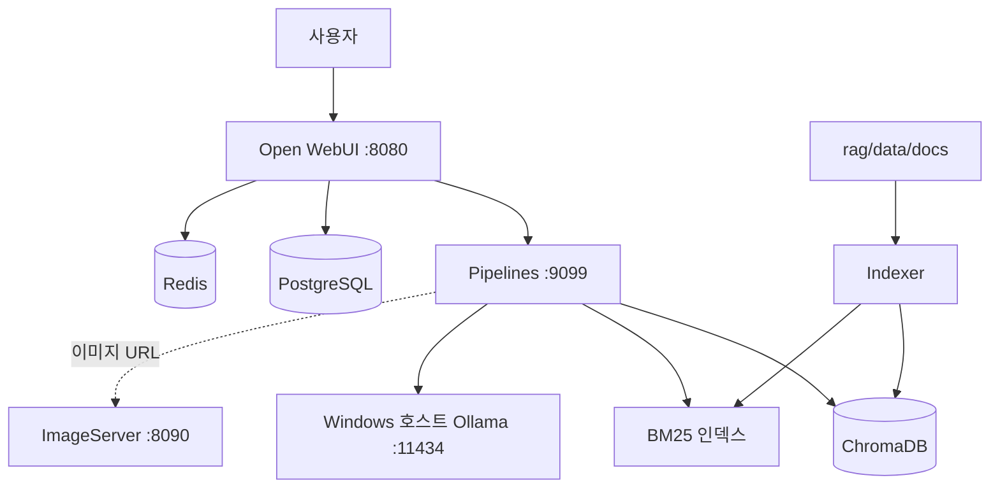
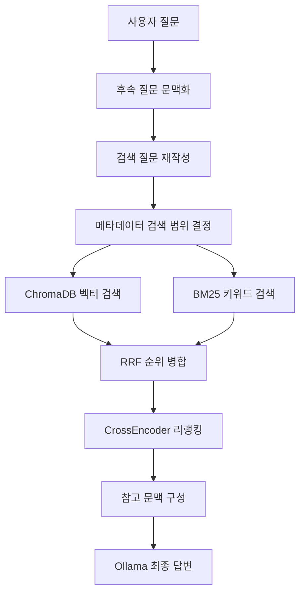

# RAG Pipeline 구조와 동작 가이드

## 한 줄 요약

이 프로젝트는 **사용자 질문과 의미가 비슷한 문서 조각을 찾은 다음, 그 조각을 LLM에 참고자료로 제공해 답변하게 하는 시스템**이다.

## 전체 구성



### 구성요소별 역할

- **Open WebUI**: 사용자가 질문하고 답변을 확인하는 채팅 화면
- **Pipelines**: 질문 처리, 문서 검색, 컨텍스트 구성, Ollama 호출을 제어하는 핵심 백엔드
- **Indexer**: 원본 문서를 검색 가능한 ChromaDB와 BM25 인덱스로 변환
- **ChromaDB**: 의미가 비슷한 문서 조각을 찾는 벡터 데이터베이스
- **BM25**: API명, 파라미터, 버전처럼 정확한 단어를 찾는 키워드 검색
- **Ollama**: 질문을 정리하고 최종 답변을 생성하는 LLM 실행 환경
- **PostgreSQL**: Open WebUI의 대화와 설정 저장
- **Redis**: Open WebUI 캐시
- **ImageServer**: `rag/data/assets`에 있는 문서 이미지 제공

Ollama는 Docker 컨테이너가 아니라 Windows 호스트에서 실행되며, 컨테이너에서는 `http://host.docker.internal:11434`로 접근한다.

## 주요 파일

```text
RAG_PipeLine/
├── docker-compose.yml
├── rag/
│   ├── pipelines/
│   │   └── rag_pipeline.py
│   ├── scripts/
│   │   ├── index_documents.py
│   │   ├── eval_retrieval.py
│   │   └── test_rag_regression.py
│   └── data/
│       ├── docs/
│       ├── eval/golden_questions.json
│       ├── chroma_db/
│       └── assets/
└── ImageServer/
```

- `rag/pipelines/rag_pipeline.py`: 질문을 받아 검색하고 답변을 생성하는 핵심 파이프라인
- `rag/scripts/index_documents.py`: 문서를 청크로 나눠 ChromaDB와 BM25에 저장
- `rag/scripts/eval_retrieval.py`: 골든 질문셋으로 검색 품질 평가
- `rag/scripts/test_rag_regression.py`: 검색 및 스트림 회귀 테스트
- `rag/data/docs`: 검색할 원본 문서
- `rag/data/chroma_db`: 벡터 DB와 `bm25_index.json` 저장 위치

## 1. 문서를 검색 가능하게 준비하는 과정

담당 파일은 `rag/scripts/index_documents.py`다.

```text
rag/data/docs 문서
    ↓
PDF·Markdown·텍스트 내용 추출
    ↓
페이지와 섹션 단위로 구분
    ↓
480토큰 청크로 분할하고 80토큰 중첩
    ↓
BGE-M3로 임베딩 벡터 생성
    ↓
ChromaDB 저장 + BM25 인덱스 생성
```

### 문서 추출과 청킹

인덱서는 PDF, Markdown, TXT, RST, HTML 문서를 읽는다. Word 문서는 직접 지원하지 않으므로 PDF나 Markdown으로 변환해야 한다.

긴 문서는 기본적으로 **480토큰 단위**로 나누며, 문맥이 경계에서 끊기는 것을 줄이기 위해 앞뒤 청크에 **80토큰을 겹쳐서** 저장한다.

### 임베딩과 ChromaDB 저장

각 문서 청크를 `BAAI/bge-m3` 임베딩 모델로 숫자 벡터로 변환한다. 의미가 비슷한 문장은 벡터 공간에서도 가까운 위치를 갖는다.

문서 청크에는 본문과 함께 다음 메타데이터가 저장된다.

- 파일명, 경로, 페이지, 섹션
- 문서 종류: `protocol`, `install`, `user_guide`
- 제품: `alpeta` 등
- 프로토콜 세대: `current`, `legacy`
- 프로토콜 버전

### BM25 인덱스 생성

동일한 문서 청크를 사용해 `rag/data/chroma_db/bm25_index.json`도 생성한다. BM25는 의미보다 정확한 단어 일치를 잘 찾으므로 벡터 검색을 보완한다.

문서를 추가하거나 수정하면 인덱서를 다시 실행해야 검색 결과에 반영된다.

```bash
docker compose run --rm indexer python /app/scripts/index_documents.py /app/docs --reset
```

## 2. 질문 한 건이 처리되는 과정

핵심 진입점은 `rag/pipelines/rag_pipeline.py`의 `Pipeline.pipe()`다.



### 2.1 후속 질문 문맥화

“그거 자세히 설명해줘”처럼 질문만으로 대상을 알 수 없으면 최근 대화를 반영해 독립적인 질문으로 바꾼다.

```text
그거 자세히 설명해줘
→ Alpeta 프로토콜의 Param3을 자세히 설명해줘
```

이 단계는 `CONTEXTUALIZE_FOLLOW_UP=true`이고 후속 질문으로 감지됐을 때만 `REWRITE_MODEL` LLM을 호출한다.

### 2.2 검색 질문 재작성

`USE_QUERY_REWRITE=true`이면 LLM이 질문을 검색에 유리한 2~4개의 표현으로 재작성한다. 이후 규칙 기반 확장으로 도메인 동의어와 버전 표현도 추가한다.

### 2.3 검색 범위 결정

질문에 포함된 키워드로 검색할 문서 범위를 먼저 제한한다.

```text
질문: Alpeta 신규 프로토콜의 Param3을 알려줘

필터:
- product = alpeta
- document_type = protocol
- protocol_generation = current
```

벡터 검색에는 ChromaDB `where` 조건으로 적용하고, BM25 결과에도 동일한 메타데이터 조건을 적용한다.

### 2.4 ChromaDB 벡터 검색

질문을 문서와 동일한 `BAAI/bge-m3` 모델로 벡터화하고, 저장된 문서 벡터와 코사인 유사도를 비교한다.

따라서 질문과 문서에 완전히 같은 단어가 없어도 의미가 비슷하면 검색될 수 있다. 임베딩 모델을 변경하면 기존 벡터와 공간이 달라지므로 전체 재인덱싱이 필요하다.

### 2.5 BM25 키워드 검색

BM25는 `Param3`, API 이름, 명령어, 버전 번호처럼 정확한 문자열이 중요한 질문을 보완한다.

- 벡터 검색: 의미가 비슷한 내용에 강함
- BM25 검색: 정확한 용어와 코드에 강함

### 2.6 RRF 병합과 리랭킹

벡터 검색과 BM25 검색 결과를 RRF(Reciprocal Rank Fusion)로 병합한다.

```text
벡터 검색 결과 ─┐
                 ├─ RRF 병합 → 리랭커 → 최종 후보
BM25 검색 결과 ─┘
```

이후 `BAAI/bge-reranker-v2-m3` CrossEncoder가 원래 질문과 각 후보 청크를 직접 비교해 관련도가 높은 순서로 다시 정렬한다.

리랭커는 답변을 작성하는 LLM이 아니다. 관련도 점수를 계산하는 분류 모델이며, 로드나 실행에 실패하면 RRF 순위를 그대로 사용한다.

### 2.7 참고 문맥 구성

최종 후보에서 다음 제한을 적용한다.

- 동일 출처가 차지할 수 있는 최대 청크 수 제한
- 전체 컨텍스트 글자 수 제한
- 질문 초점과 관계없는 청크 제거
- 실제 문서에서 찾은 이미지 URL만 포함

선택된 문서 조각은 다음과 비슷한 형태로 조립된다.

```text
=== 참고 문서 ===
[참고 1] 출처: 주장치_Protocol_v1.0.pdf
Param3 관련 문서 내용...

=== 질문 ===
Param3[0]과 Param3[1]을 설명해줘
```

### 2.8 최종 답변 생성

Ollama의 `ANSWER_MODEL`이 검색된 참고 문서, 질문, 최근 대화를 받아 최종 답변을 스트리밍한다.

현재 Docker Compose 기준 주요 모델은 다음과 같다.

- 질문 재작성 및 문맥화: `qwen3.5:4b`
- 최종 답변 생성: `qwen3.5:4b`
- 임베딩: `BAAI/bge-m3`
- 리랭커: `BAAI/bge-reranker-v2-m3`

## LLM이 담당하는 일

일반적인 질문에서는 LLM이 검색 자체를 수행하지 않는다. LLM은 최대 세 단계에서 사용된다.

1. **후속 질문 문맥화**: “그거”가 무엇인지 이전 대화로 보완
2. **검색 질문 재작성**: 검색에 유리한 표현과 키워드 생성
3. **최종 답변 생성**: 검색된 문서 조각을 읽고 답변 작성

독립적인 일반 질문이면 후속 질문 문맥화는 생략되므로 보통 질문 재작성과 최종 답변 생성, 두 번의 LLM 호출이 발생한다.

## LLM이 담당하지 않는 일

- 문서 및 질문 임베딩: BGE-M3
- 벡터 저장과 검색: ChromaDB
- 키워드 검색: BM25
- 검색 결과 병합: RRF
- 후보 재정렬: BGE CrossEncoder 리랭커
- 메타데이터 필터 생성: 코드에 정의된 규칙

## 기억하기 쉬운 핵심 정리

> **Indexer는 문서를 검색 DB로 만들고, Pipeline은 관련 문서를 찾으며, Ollama는 찾은 내용을 읽고 답변한다.**

```text
문서 준비: 문서 → Indexer → ChromaDB + BM25
질문 처리: 질문 → Pipeline → 검색 → Ollama → 답변
```

## 운영 시 기억할 사항

1. 문서를 변경하면 인덱서를 다시 실행한다.
2. 임베딩 모델을 변경하면 `--reset`으로 전체 재인덱싱한다.
3. 청킹이나 메타데이터 분류 규칙을 변경해도 재인덱싱한다.
4. 검색 로직을 변경하면 회귀 테스트와 검색 평가를 실행한다.
5. pipelines와 indexer의 `chromadb` 버전을 동일하게 유지한다.

```bash
# 검색 회귀 테스트
docker compose run --rm --no-deps --entrypoint python indexer /app/scripts/test_rag_regression.py

# 골든 질문셋 검색 평가
docker compose run --rm --no-deps --entrypoint python indexer /app/scripts/eval_retrieval.py
```
